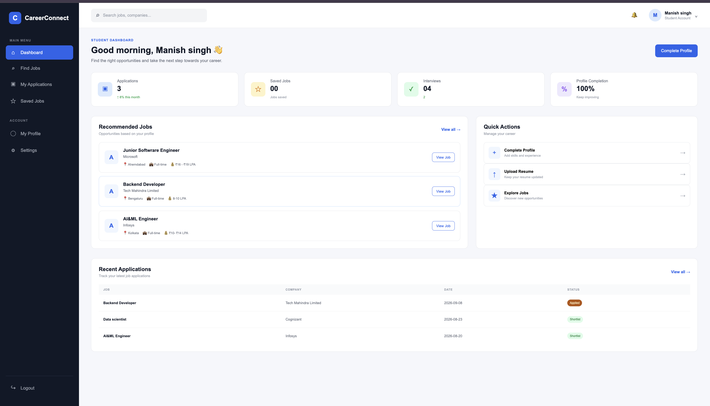
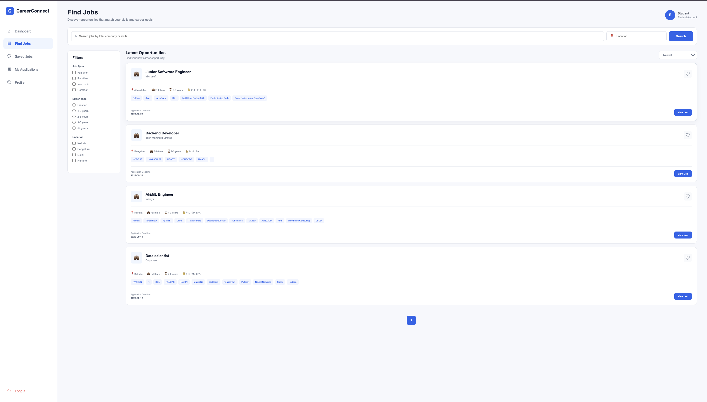
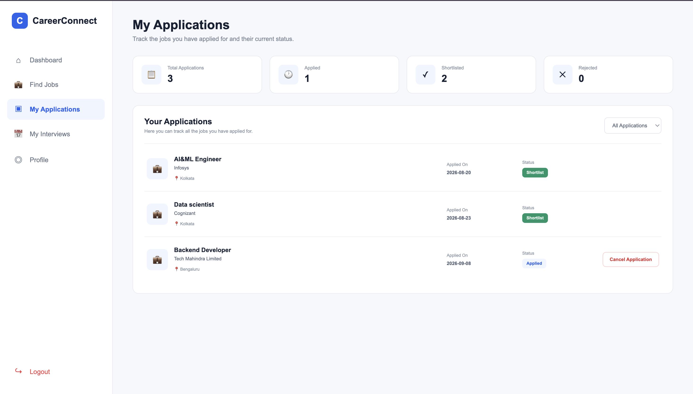
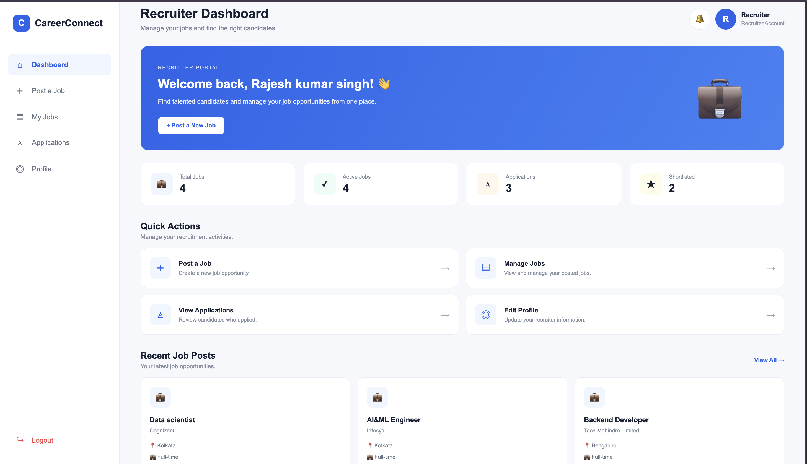
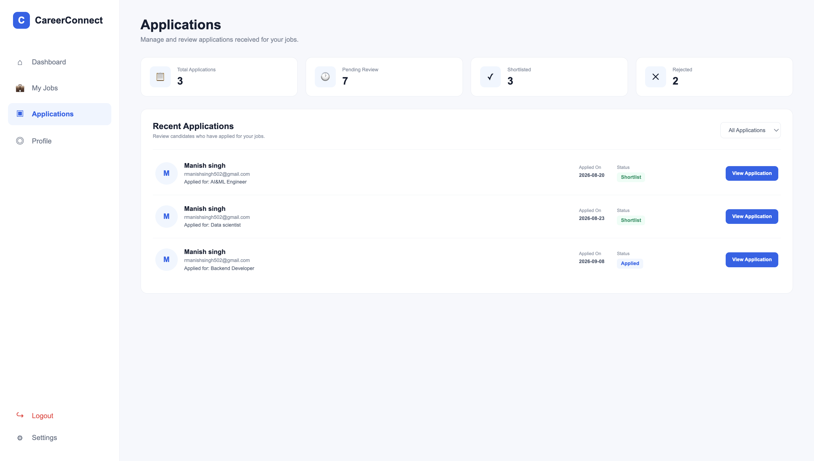
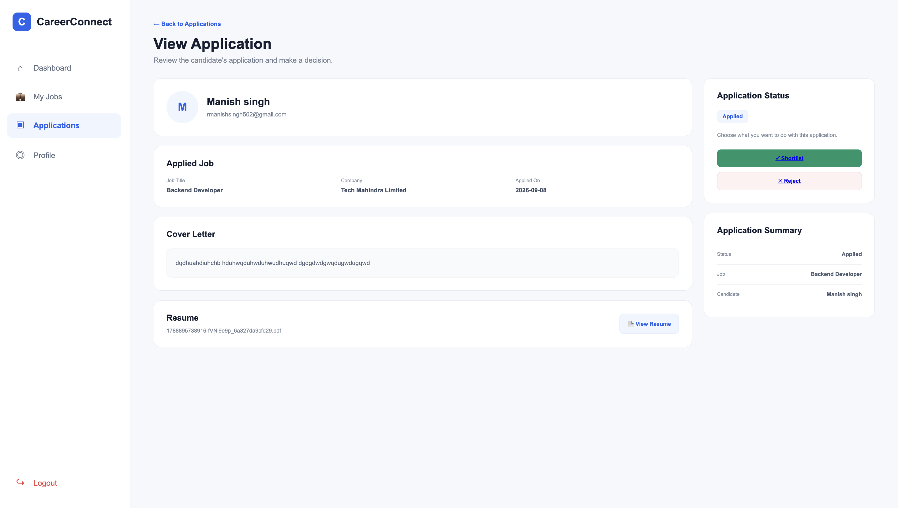
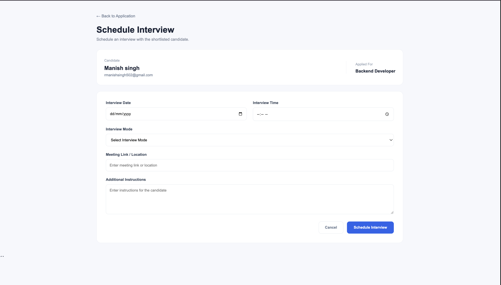
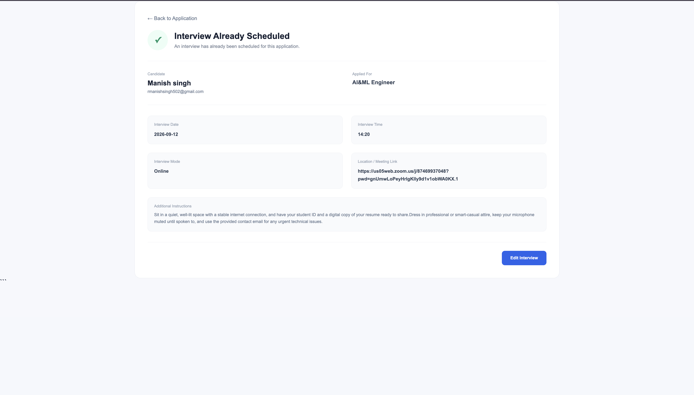

# CareerConnect

CareerConnect is a full-stack Job and Internship Management Platform designed to connect students with recruiters and simplify the complete recruitment process.

The platform provides separate student and recruiter workflows, including job discovery, applications, saved jobs, application status tracking, interview scheduling, email notifications, in-app notifications, profile management, and secure account settings.

## 🚀 Features

### 👨‍🎓 Student
- Secure registration and login
- Student profile management
- Resume upload and replacement
- Profile completion tracking
- Job search with multiple filters
- Pagination for job listings
- Save and remove jobs
- Apply for jobs with resume and cover letter
- Track application status
- Withdraw eligible applications
- View scheduled interviews
- In-app notifications
- Email notifications
- Change password and email
- OTP-based password recovery

### 💼 Recruiter
- Secure recruiter authentication
- Recruiter profile management
- Post, edit, view, and delete jobs
- View job applications
- Review applicant details and resumes
- Shortlist or reject candidates
- Schedule and reschedule interviews
- Recruitment dashboard statistics
- In-app notifications for new and withdrawn applications
- Email-based recruitment communication
- Secure account settings

## 🛠️ Tech Stack

**Frontend**
- HTML
- CSS
- EJS

**Backend**
- Node.js
- Express.js

**Database**
- MongoDB

**Authentication & Security**
- bcrypt
- express-session
- connect-mongodb-session

**Other Tools**
- Multer
- Nodemailer
- dotenv
- Git & GitHub

## 🔐 Security Features

- Password hashing using bcrypt
- Session-based authentication
- Role-based authorization for students and recruiters
- MongoDB-backed session storage
- ObjectId validation middleware
- Ownership checks for protected recruiter and student operations
- Environment variables for sensitive credentials
- File upload size and type validation
- Protected application and interview operations

## 🔔 Notification System

CareerConnect provides both in-app and email notifications for important recruitment activities.

Examples include:
- New job applications
- Application status updates
- Interview scheduling
- Interview rescheduling
- Application withdrawals

## 📁 Project Structure

CareerConnect/
├── db/
├── middleware/
├── public/
│   ├── css/
│   └── uploads/
├── views/
│   ├── application/
│   ├── auth/
│   ├── errors/
│   ├── jobs/
│   ├── partials/
│   └── student-jobs/
├── app.js
├── package.json
├── package-lock.json
└── README.md

## ⚙️ Installation & Setup

1. Clone the repository.

2. Install the required dependencies:

   npm install

3. Create a `.env` file in the project root.

4. Add the required environment variables.

5. Make sure MongoDB is running.

6. Start the application:

   npm start

7. Open the application in your browser:

   http://localhost:3000

## 🔑 Environment Variables

Create a `.env` file in the root directory and configure the required credentials.

Example:

EMAIL_USER=your_email@example.com
EMAIL_PASS=your_email_app_password

Never commit your `.env` file or real credentials to GitHub.

## 📸 Screenshots

Screenshots of the main CareerConnect interfaces will be added here.

Suggested screenshots:
- Student Dashboard
- Job Search
- Job Details
- Student Applications
- Student Interviews
- Recruiter Dashboard
- Job Management
- Recruiter Applications
- Interview Scheduling
- Notifications

## 🚧 Future Improvements

- Admin dashboard
- Advanced recruitment analytics
- Improved job recommendations
- Cloud-based resume storage
- Production deployment
- Additional notification preferences

## 👨‍💻 Author

**Manish Kumar Singh**

B.Tech Information Technology  
Netaji Subhash Engineering College, Kolkata

## 📄 Project Status

## 📸 Screenshots

### 👨‍🎓 Student Dashboard

### 🔍 Job Search

### 📄 Student Applications

### 💼 Recruiter Dashboard

### 👥 Recruiter Applications

### ⭐ Candidate Shortlisting

### 📅 Interview Scheduling

### ✏️ Interview Rescheduling

CareerConnect is currently under active development and is being prepared for deployment.